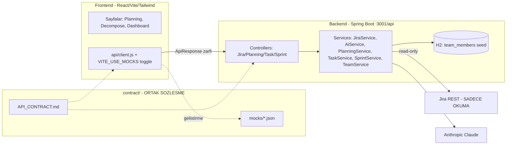

# AI-Powered Agile Manager - Contract-First Entegrasyon Planı

Bu plan, backend ve frontend'in **aynı anda, birbirini beklemeden** çalışabilmesi için tek doğruluk kaynağı (single source of truth) olan bir API sözleşmesi tanımlar. Sözleşme `contract/` klasöründe Markdown + endpoint başına örnek mock JSON olarak yaşar. Frontend mock'larla anında başlar, backend mock'ları "hedef şekil" olarak doldurur.

## Mimari ve Veri Akışı

## Değişmez Ortak Kurallar (her iki ekip uyar)

- **Zarf:** Tüm yanıtlar mevcut `ApiResponse<T>` ile sarılır: `{ "success": true, "data": {...}, "error": null }` / `{ "success": false, "data": null, "error": "mesaj" }`. Axios interceptor zaten `response.data` döndürüyor, yani frontend `res.data` ile gerçek payload'a ulaşır.
- **JSON alan adları:** camelCase (Jackson varsayılanı). İki ekip de camelCase konuşur.
- **Jira yazma YOK:** Sadece GET. Token `application.yml`'e taşınır, koda gömülmez.
- **Fallback:** Her AI çağrısı hata durumunda statik fallback döner; uygulama asla çökmez/boş ekran göstermez.
- **Ortak enum'lar (sabit string'ler):**
  - `discipline`: `FRONTEND | BACKEND | DB | TEST | DEVOPS`
  - `statusCategory`: `TODO | IN_PROGRESS | DONE`
  - `sprintState`: `active | closed | future` (Jira yerel)
  - `confidence`: `HIGH | MEDIUM | LOW`

## Adım 1 - Ortak Sözleşme Klasörü (İLK İŞ, ikisi başlamadan önce)

Yeni klasör `contract/`:
- `contract/API_CONTRACT.md` - aşağıdaki tüm endpoint şemaları + enum'lar (tek kaynak; mevcut [ai-specialist/AI_CIKTI_SOZLESMESI.md](ai-specialist/AI_CIKTI_SOZLESMESI.md) deseni genişletilir).
- `contract/mocks/*.json` - her endpoint için birebir örnek `data` payload'u. Frontend bunları fixture, backend hedef şekil olarak kullanır.

Frontend mock-first için: [frontend/src/api/client.js](frontend/src/api/client.js) içine `VITE_USE_MOCKS` env toggle eklenir; açıkken axios yerine `contract/mocks/*.json` import edilip `Promise.resolve({ success, data })` döner.

## Adım 2 - Endpoint Sözleşmesi (FROZEN CONTRACT)

Tüm path'ler `/api` altında. Aşağıdaki her madde bir mock JSON dosyasına karşılık gelir.

### Temel / Jira okuma (Epik öncesi temel)
- `GET /api/health` -> `{ "status": "ok" }`
- `GET /api/jira/sprints` -> sprint listesi:
  - `[{ "id": 101, "name": "Sprint 12", "state": "closed", "startDate": "2026-05-01", "endDate": "2026-05-14", "goal": "..." }]`
- `GET /api/jira/backlog` -> backlog issue'ları:
  - `[{ "key": "PROJ-101", "summary": "...", "issueType": "Story", "status": "To Do", "statusCategory": "TODO", "storyPoints": 5, "assignee": "Ali", "priority": "High", "labels": ["api"] }]`
- `GET /api/jira/sprints/{sprintId}/issues` -> sprint içi issue'lar (yukarıdaki backlog şekli + `resolved` bool + `resolvedDate`).

### Epik 1 - Akıllı Planlama (Predictive Planning)
- `GET /api/velocity` -> geçmiş sprint hızı:
  - `{ "averageVelocity": 23.5, "trend": "stable", "sprints": [{ "sprintId": 101, "name": "Sprint 12", "committedPoints": 26, "completedPoints": 24 }] }`
- `POST /api/planning/predict-size` -> seçili backlog task'ları için AI tahmini:
  - İstek: `{ "issueKeys": ["PROJ-101","PROJ-102"] }`
  - Yanıt: `{ "predictions": [{ "key": "PROJ-101", "summary": "...", "currentStoryPoints": null, "predictedStoryPoints": 8, "confidence": "MEDIUM", "rationale": "Benzer geçmiş task'lar ortalama 7-9 puan..." }] }`
- `POST /api/planning/blockers` (BONUS) -> bloklanma çözüm önerisi:
  - İstek: `{ "issueKey": "PROJ-101", "summary": "...", "description": "...", "blockerReason": "API dökümanı eksik" }`
  - Yanıt: `{ "key": "PROJ-101", "rootCause": "...", "suggestions": ["...","..."], "recommendedAction": "..." }`

### Epik 2 - Görev Kırılımı ve Akıllı Atama
- `GET /api/team` -> seed yetkinlik matrisi + kapasite:
  - `[{ "memberId": "u1", "name": "Ali", "skills": { "FRONTEND": 4, "BACKEND": 2, "DB": 3, "TEST": 1, "DEVOPS": 0 }, "capacityHours": 60, "currentLoadHours": 18 }]` (skill 0-5)
- `POST /api/tasks/decompose` -> task'ı alt görevlere böl:
  - İstek: `{ "issueKey": "PROJ-101", "summary": "...", "description": "...", "storyPoints": 8 }`
  - Yanıt: `{ "parentKey": "PROJ-101", "subtasks": [{ "tempId": "st1", "title": "REST endpoint", "discipline": "BACKEND", "estimateHours": 6, "description": "..." }] }`
- `POST /api/tasks/assign` -> kapasite + yetkinliğe göre atama önerisi:
  - İstek: `{ "subtasks": [{ "tempId": "st1", "title": "...", "discipline": "BACKEND", "estimateHours": 6 }] }`
  - Yanıt: `{ "assignments": [{ "tempId": "st1", "discipline": "BACKEND", "suggestedAssignee": { "memberId": "u2", "name": "Veli" }, "matchScore": 87, "reason": "Backend yetkinligi yuksek + kapasite uygun", "memberLoadAfterHours": 30, "memberCapacityHours": 60 }] }`
- (Kolaylık) `POST /api/tasks/decompose-and-assign` -> yukarıdaki ikisini tek çağrıda döndürür: `{ "parentKey": "...", "subtasks": [...], "assignments": [...] }`

### Epik 3 - AI Sprint Review ve Dashboard
- `GET /api/sprint/{sprintId}/dashboard` -> Planlanan vs Gerçekleşen:
  - `{ "sprintId": 101, "name": "Sprint 12", "plannedPoints": 26, "completedPoints": 24, "plannedCount": 10, "completedCount": 9, "deviationPercent": -7.7, "statusBreakdown": { "TODO": 1, "IN_PROGRESS": 0, "DONE": 9 }, "burndown": [{ "date": "2026-05-01", "remaining": 26 }] }`
- `GET /api/sprint/{sprintId}/review` -> AI demo raporu:
  - `{ "sprintId": 101, "headline": "Bu sprint odeme akisini tamamladik", "summary": "...", "achievements": ["...","..."], "demoScript": ["1. ...","2. ..."] }`
- `GET /api/sprint/{sprintId}/carryover` (BONUS) -> sprintler arası geçişkenlik:
  - `{ "carriedOverCount": 2, "carriedOverPoints": 5, "items": [{ "key": "PROJ-101", "summary": "...", "sprintsSpilled": 2 }] }`
- `GET /api/sprint/{sprintId}/health` (BONUS) -> 1-100 sprint sağlık skoru:
  - `{ "score": 78, "grade": "B", "factors": [{ "name": "Completion", "value": 92, "weight": 0.4, "impact": "positive" }], "summary": "..." }`

## Adım 3 - Backend Yapısı (Java/Spring)

- **Config:** [application.yml](backend/src/main/resources/application.yml)'e `jira: base-url / token / board-id / story-point-field` eklenir (token env'den: `${JIRA_TOKEN:...}`). Story point custom field (ör. `customfield_10002`) keşfedilip yazılır.
- **Yeni servisler** (`service/`):
  - `JiraService` - `RestTemplate` ile Jira read-only çağrılar (`/rest/agile/1.0/board/{id}/sprint`, `/backlog`, `/sprint/{id}/issue`, `/rest/api/2/issue/{key}`). Auth: `Authorization: Bearer <token>`. Jira JSON'unu sözleşme DTO'larına maplar.
  - `AiService` (mevcut, genişlet) - her özellik için ayrı `SYSTEM_PROMPT` text-block ve metot: `predictSizes()`, `decompose()`, `suggestBlockers()`, `generateReview()`. Her biri JSON döner, hata -> fallback.
  - `PlanningService` - kapalı sprintlerden velocity hesaplar; predict-size için velocity+geçmiş örnekleri context olarak `AiService`'e verir.
  - `TaskService` - `decompose` (AiService) + `assign` (kural tabanlı skor: `skill[discipline]` * kapasite uygunluğu, `TeamService`'ten yük).
  - `SprintService` - dashboard/carryover/health metriklerini Jira verisinden hesaplar (kural tabanlı), review için `AiService.generateReview()`.
  - `TeamService` + `DbService` - `team_members` tablosu seed (5 üye, skills JSON, capacityHours). `currentLoadHours` seed veya atamalardan.
- **Controllers** (epik başına ayrı, paralel iş kolaylığı): `JiraController`, `PlanningController`, `TaskController`, `SprintController` - hepsi `ResponseEntity<ApiResponse<T>>` döner, mevcut [ApiController.java](backend/src/main/java/com/hackathon/controller/ApiController.java) deseni.
- **DTO'lar** (`dto/`, Lombok `@Data`): `SprintDto`, `IssueDto`, `VelocityDto`, `SizePredictionDto`, `BlockerSuggestionDto`, `SubtaskDto`, `AssignmentDto`, `TeamMemberDto`, `SprintDashboardDto`, `SprintReviewDto`, `CarryoverDto`, `SprintHealthDto` + ilgili `*Request` DTO'ları (`@Valid`).

## Adım 4 - Frontend Yapısı (React)

- [api/client.js](frontend/src/api/client.js)'e sözleşmedeki her endpoint için fonksiyon eklenir (`getSprints`, `getBacklog`, `getVelocity`, `predictSize`, `decomposeTask`, `assignTasks`, `getTeam`, `getDashboard`, `getReview`, `getCarryover`, `getHealth`) + `VITE_USE_MOCKS` toggle.
- **Sayfalar** ([App.jsx](frontend/src/App.jsx) route'ları): `/planning` (backlog seçimi + predict-size tablosu + blocker), `/decompose` (task seç -> alt görev + atama kartları), `/dashboard` (sprint seç -> planned vs actual grafik + health skoru + carryover). Nav [Layout.jsx](frontend/src/components/Layout.jsx)'e eklenir.
- **Bileşenler:** `SprintSelector`, `BacklogTable`, `PredictionCard`, `SubtaskCard`, `AssignmentBadge`, `MetricCard`, `HealthGauge`, `DeviationChart` (basit Tailwind/SVG bar - ekstra grafik kütüphanesi yok). Her sayfa loading/error/success state'lerini ayrı yönetir.

## Adım 5 - Paralel Çalışma Akışı

1. Sözleşme (`contract/`) birlikte 15 dk'da dondurulur -> bu plandaki şemalar kopyalanır.
2. Frontend `VITE_USE_MOCKS=true` ile tüm UI'ı mock JSON üzerinden bitirir.
3. Backend mock'lardaki şekle birebir uyan gerçek endpoint'leri yazar (Jira + AI).
4. Entegrasyon: frontend `VITE_USE_MOCKS=false` yapar; alanlar birebir uyumlu olduğu için sorunsuz birleşir.
5. Sözleşme değişirse: önce `contract/API_CONTRACT.md` + mock güncellenir, iki ekibe haber verilir (mevcut "Ekip İletişim Protokolü" deseni).

## Adım 6 - Başlangıç Prompt'ları (ekiplere verilecek)

Plan onaylanınca iki ekip için kopyala-yapıştır başlangıç prompt'ları üretilecek (aşağıdaki taslaklar planın çıktısıdır):

**Backend prompt (özet):** "AI_CONTEXT kurallarına ve `contract/API_CONTRACT.md`'ye sadık kalarak Jira read-only `JiraService`'i kur, ardından Epik 1 endpoint'lerini yaz. Yanıtlar `ApiResponse<T>`; mock JSON'daki alan adları/tipleri birebir korunacak. Adım adım git, önce `/api/jira/*`."

**Frontend prompt (özet):** "AI_CONTEXT kurallarına ve `contract/API_CONTRACT.md`'ye sadık kalarak `VITE_USE_MOCKS=true` ile mock-first çalış. `client.js`'e sözleşme fonksiyonlarını ekle, `/dashboard` sayfasını mock ile bitir. Sadece Tailwind, ekstra grafik kütüphanesi yok."

Tam prompt metinleri (3-4 paragraf, dosya yolları ve örnek çağrılarla) plan onayından sonra teslim edilecek.